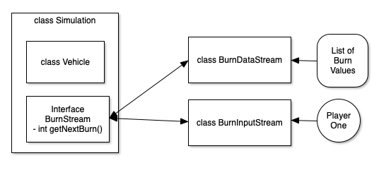
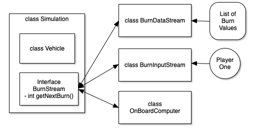

# Zip Mars Lander
a simulation of the SpaceX Starship landing on Mars.

### Mars Simulation

_Elon Musk has sent a really expensive Starship to land on Mars.
The on-board computer has failed! You have to land the spacecraft manually.
Set burn rate of retro rockets to any value between 0 (free fall) and 200
(maximum burn) kilo per second. Set burn rate every 10 seconds.
You must land at a speed of 2 m/s or 1 m/s. Good Luck!_


Your project is to do two things.

- build the code for the Vehicle class.
  - there is quite  bit of pseudocode in the Vehicle and Simulation classes
- design a new, replacement landing computer
  - You need to write a method that allows the lander to land safely (after you can do it manually)

If you're having trouble understanding what we mean, look at the
[SpaceX Mars Mission](https://www.spacex.com/human-spaceflight/mars/)
Scroll to the bottom of the page, and watch the simulation.
See how the Starship adjusts it's thrust cone to slow down and land.

This is basically a simulation that lets a user enter a rocket burn amount every
ten seconds. At each point, the player enters a number between 0 and 200. 
It turns out that a burn of 100 is enough to not change the velocity downwards at all.
A burn of zero increases the speed of descent by +100 m/s, a burn of 200 reduces 
the speed of descent by -100 m/s.

The main loop of the simulation looks like this:

``` java
        DescentEvent status;
        int burnInterval = 0;
        printString(gameHeader());
        printString(getHeader());
        while (vehicle.stillFlying()) {
            status = vehicle.getStatus(burnInterval);
            System.out.print(status.toString()+"\t\t");
            vehicle.adjustForBurn(burnSource.getNextBurn());
            if (vehicle.outOfFuel()) {
                break;
            }
            burnInterval++;
            if (burnInterval % 9 == 0) {
                printString(getHeader());
            }
        }
        printString(vehicle.checkFinalStatus());
```

Looking at the source files, you'll see an interface called `BurnStream`. 
It is how input into the game is handled.
See how if there is an Interface for BurnStream, you can implement a few different ways of handling input to the vehicle.
The first is a list of pre-calculated burns, which should allow the lander to land safely from a predetermined altitude.
The second is the one used to play with a human player.
Use this one to play the game and figure out the simulation.
And, in the Hard Part below, you can write a new class, OnBoardComputer, that can
act like a smart software system that mimics a human and lands the Starship all the time safely.

And this means that the "real game" which takes user input looks like this

``` java
    public static void main(String[] args) {
        Simulation game = new Simulation(new Vehicle(Simulation.randomaltitude()));
        BurnStream burnSource = new BurnInputStream();
        game.runSimulation(burnSource);
    }
```

and a unit test version of the simulator might look like this:

``` java
    public void runSimulationCrash() {
        int[] burns = {0,0,0,0,0};
        BurnStream burnSource = new BurnDataStream(burns);
        Simulation game = new Simulation(new Vehicle(5000));
        game.runSimulation(burnSource);

    }
```

In the first `main`, the user inputs the various burn numbers, trying to land the Starship
very slowly.

In the second, we start at a know altitude, and don't burn any fuel, which should crash
the Starship every time. There is a second unit test that has a series of burns that
should land Starship softly enough to survive.

The main layout of classes looks like this.



## Hard Part

BUT, while you can runs your simulations, and maybe even land once or twice,
how do you create an onboard computer that lands the Starship?

Elon may be willing to pay you a lot of money for it(!) (no, not really, geez!)

Now, the hard part of this lab, is 
__how do you create a class that gets DescentEvent objects as telemetry,
and computes a new burn that lets the Starship land safely?__

This class, called `OnBoardComputer`, you need to take in the status object 
(Descent Event) which tells you the status of the vehicle. 
Then, you make a make a burn recommendation.
And you keep doing that until the Starship lands softly.

The math is not hard. 
But you do need to land at a speed of 1-2 m/s to be successful.

Notice how the DescentEvent gives you the time, the speed, the altitude and how much fuel is left.
You'll see that burning 100 kilos leaves the speed the same as last time.

And you could even do a table:
Burn is in kilos, the DeltaV (change in velocity) is in m/s

| Burn | DeltaV |
|------|--------|
|  0   |  +100  |
| 100  |    0   |
|200|-100|
|105| -5|
|150|-50|
|95|+5|
|50|+50|

So if you need to land at 2 m/s, you need a way to slow down alot, and do it very close to the martian surface.

Maybe the way to do this is to descend from your initial altitude until you're at about 
1000m and moving at 100m/s, then descend to 200m at 100 m/s, and then descend to 50m at 25m/s.
When at 50m, slow to 10m/s, then descend to 10m and slow to 2m/s. 
Then maintain speed and descend until you land.

You may need to dig up some high school physics to figure this out.

Hint: `a = (speed * speed)/(2 * altitude)`

And remember, you brun zero kilos of fuel to increase descent speed by 100 m/s.
You burn 100 kilos of fuel to maintain your current descent speed.
You Burn 200 kilos of fuel to reduce you descent speed by 100 m/s.

So your end goal makes the class diagram look like this:


Remember, there are astronauts onboard the Starship, so you need to make
sure they stay safe!

-kristofer
